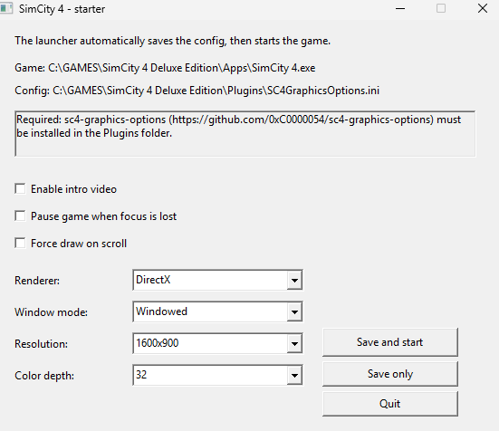

# SimCity 4 Starter

A small Windows launcher for SimCity 4. It saves the selected graphics settings, creates `Plugins\SC4GraphicsOptions.ini`, and starts the game.



## Folder layout

Place `simcity4-starter.exe` in the SimCity 4 root folder, not in `Apps`:

```text
SimCity 4 Deluxe Edition\
|-- simcity4-starter.exe
|-- Apps\
|   `-- SimCity 4.exe
`-- Plugins\
```

## Requirements

- SimCity 4 installed with `Apps\SimCity 4.exe` next to the launcher
- [sc4-graphics-options](https://github.com/0xC0000054/sc4-graphics-options) installed in the game's `Plugins` folder

## Usage

1. Place `simcity4-starter.exe` in the SimCity 4 root folder, beside `Apps`.
2. Make sure the only game executable path is `Apps\SimCity 4.exe`.
3. Select the graphics options.
4. Click **Save and start**.

The launcher stores its settings in `starter-settings.ini` and writes the graphics configuration to `Plugins\SC4GraphicsOptions.ini`.
